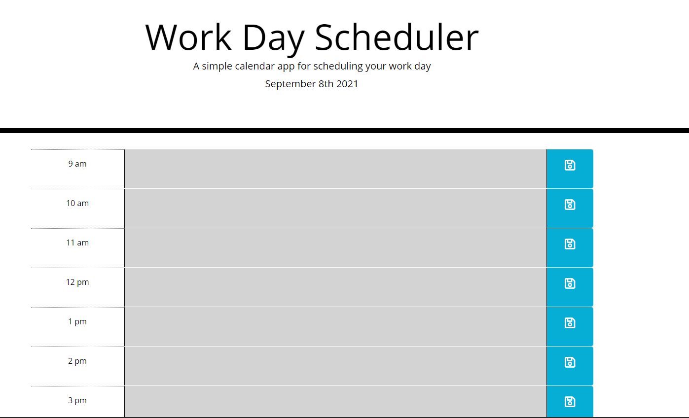
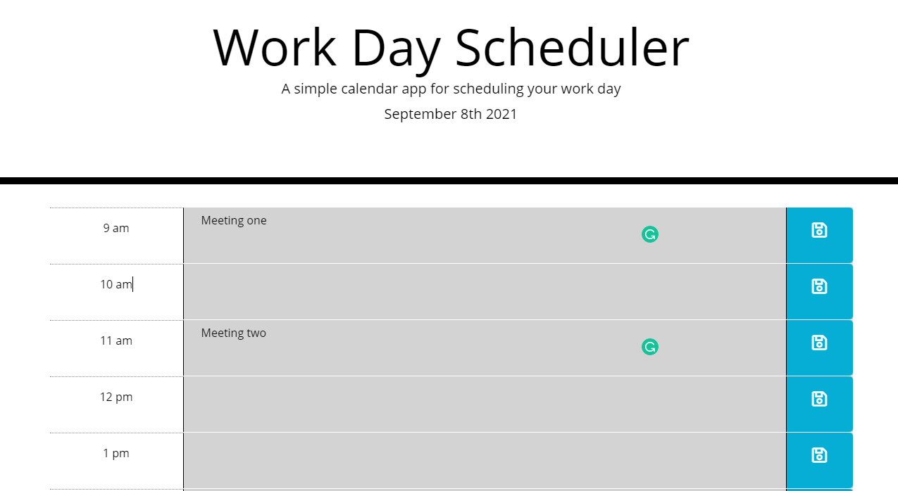

# Work-Day-Scheduler
Hello this is an Work Day Scheduler that will help you
plan out you day and allow for you to time manage better

# URL
https://sushichen.github.io/Work-Day-Scheduler/

# How does it Work?
You will be want to put what activity in the time slot that its set for.

After you have inserted the activity you can click on the save button which will allow for it to save to your local storage.

When the time has past the timeblock wil change from green to grey . So the color meanings are for past present and future.
Grey = Past Red = Current Green = Future.
(The Following images will only show grey due to photos being taken after 5pm )
<!-- The Following images will only show grey due to photos being taken after 5pm -->

